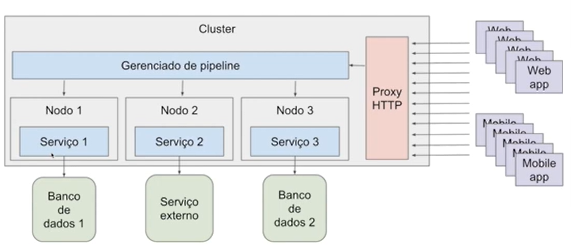
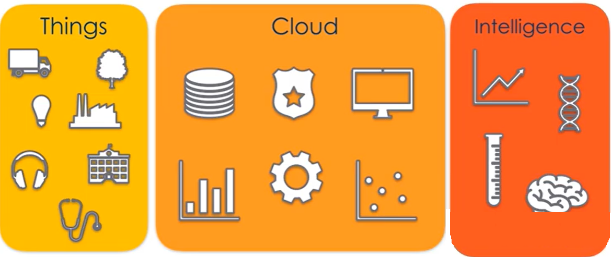

# Bootcamp Banco Carrefour

## Fundamentos da Arquitetura de Sistemas

### Vantagens e desenvolvimento de Web Services

#### O que são Web Services

São soluções para aplicações se comuniquem independente de linguagem, software e hardwares. Podemos dizer que eles são API's que se comunicam por meio de redes sobre o protocolo HTTP (Todo serviço Web é uma API mas nem todo API é um serviço web)

Inicialmente foram criados para troca de mensagens utilizando linguagem XML (Extensible Markup Language) sobre o protocolo HTTP sendo identificado por URI (Uniform Resource Indetifier) que nada mais é do que uma URL mais completa. Mas suportam outras estruturas

As vantagens de utilização de serviços web são ter uma linguagem comum, integração, reutilização de implementação, segurança e custos.

#### SOAP

SOAP (Simple Object Access Protocol), é um protocolo baseado em XML para acessar serviços web principalmente por HTTP (mas não somente), ele é independente de plataforma e software sendo um meio de transporte de mensagens genérico.

A arquitetura do SOAP é utilizada como padrão de troca de mensagens em HTTP

#### XML

XML (Extensible Markup Language) é uma linguagem de marcação criada pela W3C que facilita a separação de conteúdo pois possui tags e elas não tem limitação de criação. É uma linguagem comum para integrações entre aplicações.

#### Estrutura do SOAP

O SOAP message possui uma estrutura única que deve sempre ser seguida.

* **SOAP Envelope** 

É o primeiro elemento do documento e é usado para encapsular toda mensagem SOAP

* **SOAP Header**

É o elemento onde ficam informações e atributos ou seja os metadados da requisição.(IP, DNS, Credenciais)

* **SOAP Body**

É o elemento que contém os detalhes da mensagem. (Conteúdo e dados da mensagem)

Exemplo Mensagem SOAP

#### WSDL

WSDL (Web Services Description Language) é um descritivo de como funciona o serviço Web SOAP, funciona como um contrato de serviço, trazendo um documento em XML com especificações de acesso, operações e métodos.

#### XSD

XSD (XML Schema Definition)  é um schema XML usado para definir a estrutura de dados do SOAP Message, funciona como uma documentação de como deve ser montado o SOAP message que será enviado através de Web Service. Pode conter os tipos validos de variáveis, campos obrigatórios etc.

#### REST

REST (Representational State Transfer) é um estilo de arquitetura de software que define a implementação de um serviço web que pode trabalhar com os formatos XML, JSON entre outros. Permite integrações entre aplicações e também entre cliente e servidor em páginas web e aplicações e utiliza métodos HTTP.

#### API

API ( Application Programming Interface) São conjuntos de rotinas documentados e disponibilizados por uma aplicação para que outras aplicações possam consumir suas funcionalidades. Facebook, Twitter, Telegram, Whatsapp, GitHub são exemplos de serviços Web que disponibilizam API's para acesso de suas funcionalidades.

#### Principais métodos HTTP

* **GET** : Solicita a representação de um recurso
* **POST**:  Solicita a criação de um recurso
* **DELETE**:  Solicita a exclusão de um recurso
* **PUT** : Solicita a atualização de um recurso

#### JSON

JSON (JavaScript Object Notation) formatação leve utilizada para troca de mensagens entre sistemas, usa uma estrutura de chave e valor e também listas ordenadas.

#### Código de Estado

Usado pelo servidor para avisar o cliente sobre o estado da operação solicitada.

* 1xx - Informativo
* 2xx - Sucesso
* 3xx - Redirecionamento
* 4xx - Erro do Cliente
* 5xx - Erro do Servidor

Para mais informação acesse https://developer.mozilla.org/pt-BR/docs/Web/HTTP/Status

### Conceitos de arquitetura em aplicações para internet

#### Tipos de arquitetura

* Monolito

O monolito possui baixa complexidade e o monitoramento é simplificado, mas a utilização de uma única linguagem para toda aplicação torna o esquema mais restrito principalmente em relação acoplamento. Sua escalabilidade também é complexa pois todo o serviço deve ser escalado junto.

**Proxy** é o termo utilizado para definir os intermediários entre o usuário e seu servidor. Todos os dados que deseja acessar na internet são disponibilizados por um servidor. Logo, o servidor proxy atende seus pedidos e repassa os dados do usuário à frente. O cliente conecta-se a um servidor proxy, requisita algum serviço e cabe ao proxy enviar a solicitação do endereço local para o servidor, traduzindo e repassando o seu pedido para a sua aplicação.

* Microserviços

Possui uma stack dinâmica pois cada serviço pode ser programado na linguagem mais adequada e a escalabilidade é simples pois é individual e pode ser definida pelo serviço mais solicitado.

A principal desvantagem desse esquema, é que a dependência de comunicação entre os serviços podem tornar o modelo muito complexo. Para tanto pode ser utilizada a figura do **message broker** que faz intermediação das mensagens entre serviços podendo armazenar mensagens ou solicitar outro serviço caso algum deles esteja indisponível

Como o **message broker** pode se tornar um gargalo da aplicação pensando em reduzir essa dependência alguns modelos de microserviços utilizam um gerenciador de pipeline, que pode tratar erros, gerenciar respostas e administrar todas as requisições do proxy HTTP e dos serviços.

Os esquemas que usam message broker tem comunicação assíncrona, assim os erros podem ser ignorados ou não tratados devidamente travando o esquema de funcionamento, para isso pode ser necessário utilizar uma fila de re-tentativas (dead letter queue) que armazena os erros e tenta processar novamente em outro momento.

Nos esquema síncronos como o de pipeline é necessário um gerenciador de erros para que a sequencia de funcionamento seja respeitada independente do erro, podendo utilizar o esquema de dead letter queue para armazenar o erro e tentar novamente em outra oportunidade ou desfazer passos anteriores caso seja necessário e não cause redundâncias em outras tentativas.

### A arquitetura de aplicações móveis e internet das coisas

Objetivos da internet das coisas:

* Embutir sensores em objetos do dia a dia
* coletar dados dos sensores
* usar os dados para tomar decisões

#### Aplicações

* Smart building (Edifícios com sistemas monitorados e dados utilizados para implementação de melhorias personalizadas, eficiência energética e segurança)
* Smart Home (Soluções residenciais de automação e personalização)
* Weareble ( Principalmente para monitoramento de saúde)
* agricultura (Para monitorar variaveis ambientais e de saude da plantação)
* RFID Supply Chain (Monitoramento de processo produtivo e logística)
* Eficiência Energética (monitoramento na geração, distribuição e consumo de energia)

#### Desafios

* Privacidade e segurança
* Infraestrutura 
* Processamento dos dados

#### Conectando as coisas

Para conectar os dispositivos e coletar os dados os dispositivos devem ter alguns atributos

* Baixo consumo de energia
* Rede de dados limitado
* resiliência (capacidade continuar funcionando mesmo que falte energia ou rede)
* segurança
* customização
* baixo custo

#### Protocolo de comunicação para IoT

O protocolo mais utilizado para dispositivos IoT é o MQTT. Esse protocolo foi criado pela IBM para soluções da indústria petrolífera. Suas principais características são:

* Base na pilha do TCP/IP
* Protocolo de mensagem assíncrona (M2M)
* Padrão OASIS suportado pelas principais linguagens de programação

#### A flexibilidade dos tópicos.

O caractere + pode ser utilizado para substituir uma opção especifica para então receber todas as opções

Exemplo: mqtt://broker/+/accelerometer

recebe as informações de acelerômetro de todos os usuários.

O caractere # pode ser utilizado para receber todas as informações geradas por um determinado publish

Exemplo:  mqtt://broker/+/#

recebe as informações de todos os usuários de todos os sensores

#### Níveis de comunicação entre Client e Broker

#### A função da nuvem no IoT

Aplicações IoT geram quantidade massiva de dados ou necessitam de tratamento desses mesmos dados em tempo real, logo a nuvem oferece soluções de escalabilidade e tecnologias que proporcionam mais facilidade para essas aplicações.

O worker é o programa que você vai fazer para destinar ou fazer um pré tratamento dos dados
