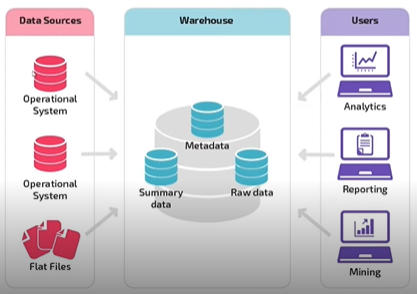
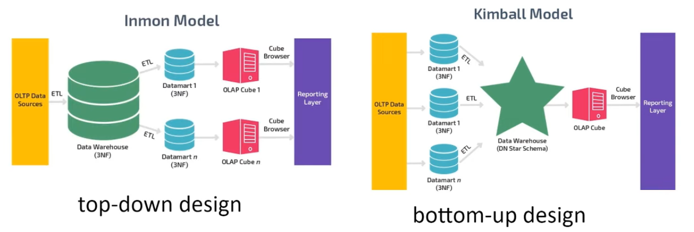

# Bootcamp Banco Carrefour

## Introdução a Engenharia de dados

### O que são dados?
Dados são informações recebidas de vários locais, mobile, sensores, IoT, veículos, sistemas, mídias sociais, browsers, etc. Disponibilizados em formatos e medidas diversos.

### Tipos de dados

São basicamente dois tipos de dados, estruturados e não estruturados.

1. Estruturados:
Possuem estrutura rígida e previamente planejada, cada campo tem um formato único e existe correlação entre os campos. São 20% dos dados disponíveis hoje.

**Exemplos:** Banco de dados de clientes de uma empresa de e-commerce.

2. Não estruturados:
Esse tipo de dado não tem uma estrutura previamente planejada, costumam ser flexíveis e dinâmicos o que aumenta a complexidade em suas consultas. São 80% dos dados disponíveis hoje.

**Exemplos:** Comentários de usuários sobre um produto ou serviço no Twiter.

### O papel do Engenheiro de dados.

O engenheiro de dados tem a missão de processar os dados, dando a eles estrutura, quando necessário, garantindo um visualização da informação de forma  prática e acessível ao publico de interesse e principalmente garantindo a privacidade dos envolvidos na geração daquela informação. 
Esse trabalho garante maior precisão e confiança na tomada de decisão o que consequentemente minimiza riscos e reduz custos.
Em resumo um engenheiro de dados tem a missão de transformar dados em informação.

**Dados + Processamento =  Informação**

### Responsabilidades:

Garantir que os dados estejam disponíveis para análise de forma segura. DPO(data protection officer)

1. Coleta
   * Jobs (batch) períodos agendados
   * Realtime (Streaming) dados gerados e analisados no mesmo tempo que ocorrem
2. Transformação
   * ETL (Extração, transformação e carga)
   * Pipelines
3. Armazenamento
   * Banco de dados
   * Repositórios de arquivos
4. Disponibilidade
   * APIs
   * Arquivos
   * Banco de dados

## Conceitos de BI (Business Intelligence)

### Definição:

Segundo Gartner é o processo de transformar dados em informações e informações em conhecimento com propósito de converter o volume de dados em informações relevantes para o negócio, por meio de relatórios analíticos, sempre olhando para dados do passado.

### Aplicações:

* Query Report (Relatórios e consulta de informações)
* Mineração de dados
* Budget & Forecast (Orçamentos)
* KPI's (Indicadores)
* Dashboards de gestão

## Data Warehouse

### Definição:

É uma arquitetura de armazenamento projetada para conter dados extraídos de sistemas de transações, armazenamentos de dados operacionais e fontes externas, combina esses dados em um formulário de resumo agregado adequado para análise de dados em toda empresa e relatórios para necessidades de negócios predefinidas. É fundamental para um sistema de apoio a decisão

### Estruturas de dados:

#### OLTP (Online Transactional Processing)

* Foco => Operações do dia a dia
* Origem=>  Transações em tempo real da organização
* Performance => Milissegundos
* Volatilidade => Atualizações curtas e rápidas iniciadas pelo usuário
* Design => Normalizado

#### OLAP (Online Analytical Processing)

* Foco =>  Suporte e decisão (Visão agregada por assunto)
* Origem => Bases de dados de sistemas transacionais - OLTP
* Performance => Minutos / Horas
* Volatilidade => Geralmente grande devido á agregação de grandes conjuntos de dados
* Design => Desnormalizado

### Arquitetura básica:

#### Variações:

* Staging Area : Todo data fornecido através dos Data Sources é armazenado num banco de dados intermediário antes de ser submetido à Warehouse.

* Data Marts: Após os dados serem depositados numa Data Warehouse, eles são separados em áreas especificas de acordo com o  modelo de negócios.

  

  

  

  ### Movimentação dos dados

  #### ETL (Extract, Transform, Load)

  É um processo automatizado que coleta dados bruto, extrai as informações necessárias para análise, transforma em um formato que atende ás necessidades de negócios e carrega em um data warehouse.

  

  

  As movimentações podem ser realizadas utilizando os seguintes métodos:

  * Cargas completas - truncate & load
  * Cargas incrementais - data / ID
  * Frequência (diária, semanal, mensal)

  A qualidade dos dados são muito importantes quando se trata de ETL, a  padronização e validação de dados e o suo de metadados melhoram significativamente a performance das movimentações. Os principais desafios das ferramentas de ETL são garantir escalabilidade, acurácia e flexibilidade para manusear fontes de dados diversas.

  

  ### Data Marts (DM)

  É um subconjunto de dados de um data warehouse, é orientado para uma linha orientada de negócios, contendo um repositório de dados resumidos, coletados para análise em um seção ou unidade especifica.

  O uso de Data marts e suas formas possíveis depende muito do modelo de dado e modelo de negócio.

  

  

  

  

=======
>>>>>>> 6f395069b3e356ec4c1d50980f9ee477272985f1
