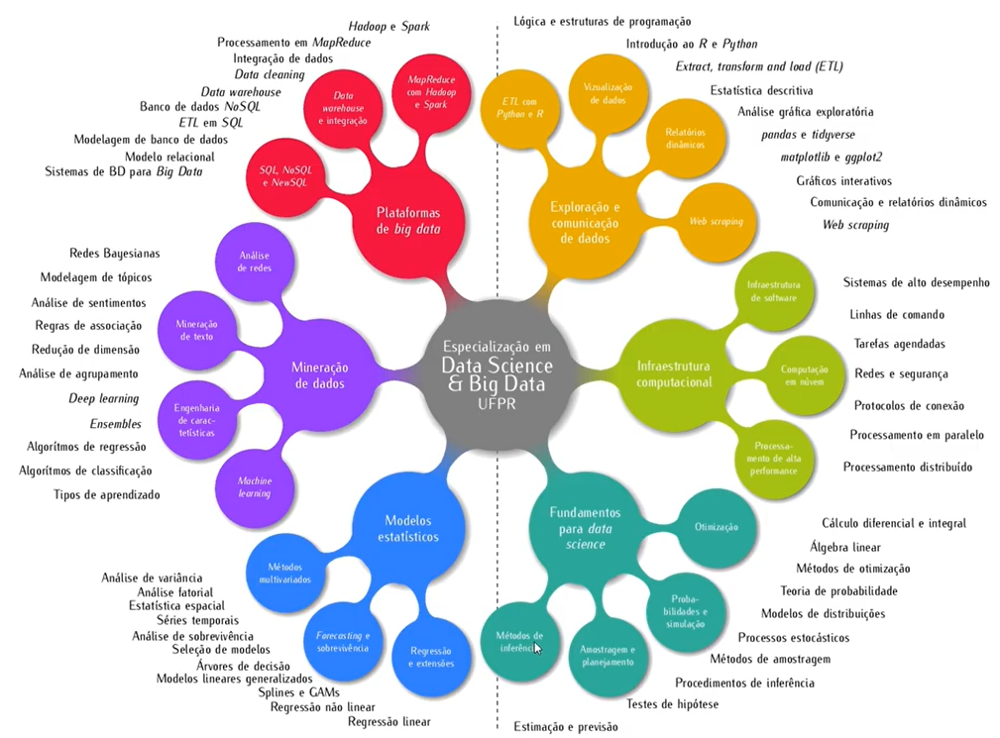
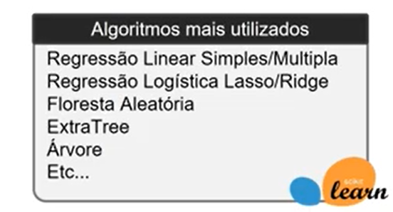
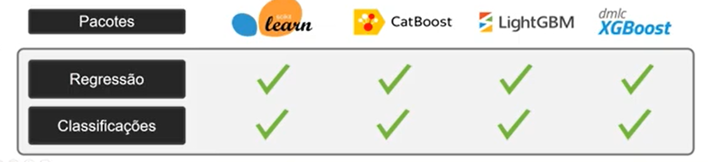
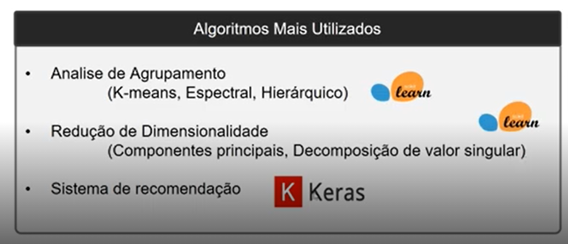

# Bootcamp Banco Carrefour

## Introdução a ciência de dados

A figura abaixo dá uma visão geral sobre alguns tópicos e segmentos abordados pela ciência de dados.

### Tipos de aprendizagem de máquina

Basicamente temos dois grandes grupos aprendizado supervisionado e aprendizado não supervisionado.

* **Supervisionado:**  A ideia do modelo é fazer uma antecipação do problema dado as características do objeto de observação. (Variável resposta pré-definida e categórica)

  -  **classificação**: a saída é o resultado final (positivo ou negativo, verdadeiro ou falso, adimplente ou inadimplente)

  - **regressão**:  a saída é uma probabilidade daquele objeto pertencer a um certo grupo de interesse.

    

    

    

* **Não Supervisionado**: Nesse modelo não temos uma variável resposta pré-definida, assim obtemos as características do objeto analisado observando os dados disponibilizados. (Variável resposta não existe)

  - **Clustering**:  tem a capacidade de identificar características próximas entre os dados e agrupar objetos semelhantes da melhor maneira possível 

  - **Associação:** A partir dos dados é possível inferir quais grupos tem dependência direta do outro, um bom exemplo seria identificar num supermercado quais grupos de produtos são comprados juntos a partir de dados históricos de compras de vários clientes.

  - **Redução da dimensão:** É o método que busca na base de dados quais são os dados que tem maior impacto no resultado final, fazendo com que colunas desnecessárias sejam excluídas.

    

